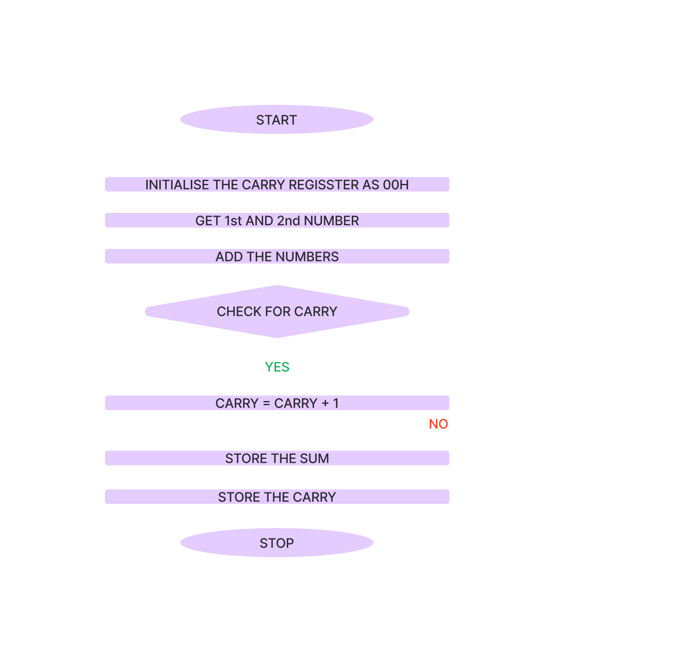

# MPMC Lab ALP's

## [ 1.a ] ALP to add two 8 bit numbers
| CODE       | COMMENTS                                     |
|------------|----------------------------------------------|
| `MVI A, 02H` | 1st Number Loaded to Accumulator           |
| `MVI B, 03H` | 2nd Number Loaded to B Register            |
| `ADD B`    | A <== A+B                                   |
| `STA 1050H` | Store result in memory location 1050H       |
| `HLT`      | End the program                              |

## [ 1.b ] ALP to add two 8 bit numbers from a _memory location_
| CODE       | COMMENTS                                              |
|------------|-------------------------------------------------------|
| `LXI H, 1000H` | Fetch data in memory location 1000H, Move to H    |
| `MOV A, M` | Move data in H-L pair to Accumulator                  |
| `INX H`    | Increment register H                                  |
| `ADD M`    | A <== A+M                                             |
| `STA 1002H` | Store the result in memory location 1002H            |
| `HLT`      | End the program                                       |

## [ 1.c ] ALP to add two 16-bit numbers from consecutive memory locations and store result

| CODE           | COMMENTS                                                  |
|----------------|-----------------------------------------------------------|
| `LXI H, C050H` | Load memory location C050H into H-L pair                  |
| `MOV A, M`     | Move data from H-L pair memory to Accumulator             |
| `INX H`        | Increment H-L to point to the next memory location        |
| `MVI B, 00H`   | Initialize B register to 00H for handling carry           |
| `ADD M`        | Add the content of memory (C051H) to Accumulator          |
| `JNC LOOP`     | Jump to LOOP if no carry is generated                     |
| `INR B`        | Increment B register if carry is generated                |
| `LOOP STA C050H` | Store the lower byte result at memory location C050H    |
| `MOV B, A`     | Move Accumulator value to B register                      |
| `STA C050H`    | Store the final result in memory location C050H           |
| `HLT`          | End the program                                           |

